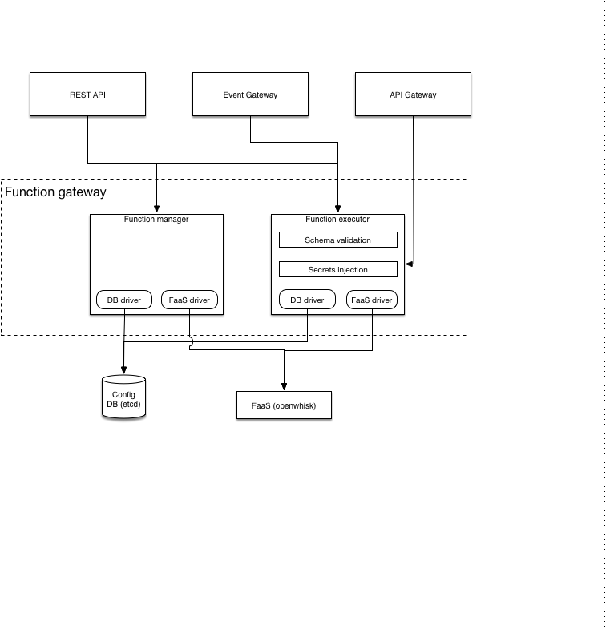

# Function gateway

A set of services to handle function lifecycle and execution.

## Problem statement

In order to run a function, user must have a way to trigger it - function must be accessible through some sort of API.
This API will be implementation specific, and will differ across different providers. This may lead to a tightly coupled
implementation where it's nearly impossible to switch FaaS execution engines. Instead, we should define an API that we
own, and that allows us to eventually change the FaaS implementation if needed by providing adapters for them. Also, we
can differentiate two main activities related to functions - their configuration (CRUD operations), and their execution.
Both cases must be addressed, and both cases have different characteristics.

### User stories

1. As a *developer*, I want to create a *function* with defined *input*, *execution context* and other *metadata*.
2. As a *developer*, I want to execute previously created *function* with *payload* provided by me.
3. As a *developer*, I want to list all *functions* created by me.

## Proposed Solution

Propsed solution includes a Function gateway service, which is logically split into two components: Function Manager and
Function Executor.

Function Manager:
* Exposes API for CRUD operations on functions.
* Provides abstraction over FaaS backend (using defined FaaS driver).

Function executor:
* Exposes simple API to execute a function a retrieve its result.
* Provides pluggable middleware engine to execute custom preprocessing, like validation or secret injection.
* Provides abstraction over Faas backend execution API (using defined FaaS driver).
* Collects function execution data and stores them for future use.

## Requirements

* REST API which will guard access to component
* FaaS backend (for example, OpenFaaS)

## Design

### Function manager
Function manager is responsible for CRUD operations on functions.

### Function executor
Function executor is responsible for executing functions. It can run preprocessing & postprocessing operations, like
data validation or secrets injection.

## Milestones

TBD

## Open Issues

* What do we do with functions that fail when executed in response to an event?
* Single event can trigger multiple functions. Should we allow to customize execution strategy?
* Should we validate payload in event manager, or only after it's sent to function executor?
